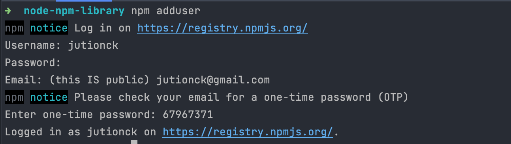
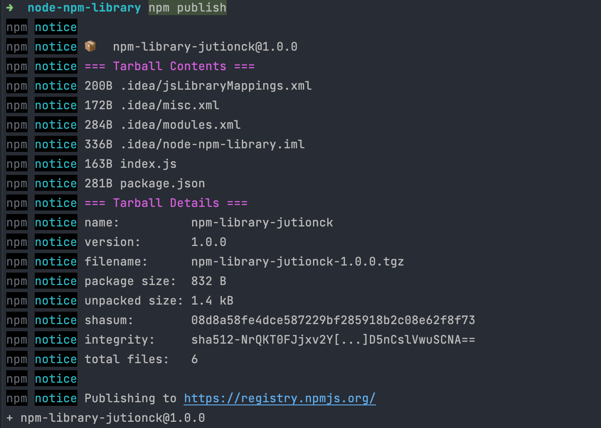

## NPM (Node Package Manager)

### Materi
- NPM tidak hanya digunakan untuk management project NodeJS
- NPM juaga bisa sebagai management dependency
- NPM pasti mempunyai sebuah file yang bernama `package.json`
- Kemudian ada sebuah folder dari hasil `package.json` yaitu `node_modules`
- Dependency yang tersedia bisa kunjungi di web https://npmjs.com

### Instalasi
- NPM akan otomatis terinstall apabila sudah menginstall `NodeJS`
- Cek versi NPM `npm --version`

### Membuat Project
- Buat folder project
- Kemudian generate `package.json` dengan mengetikkan ini diterminal `npm init` (masukkan informasi yang sesuai)
- Atau bisa juga `npm init -y`

### Package.json
```json
{
  "name": "nodejs-course",
  "version": "1.0.0",
  "description": "",
  "main": "index.js",
  "scripts": {
    "test": "echo \"Error: no test specified\" && exit 1"
  },
  "repository": {
    "type": "git",
    "url": "git+https://github.com/jutionck/nodejs-course.git"
  },
  "keywords": [],
  "author": "Jution Candra Kirana",
  "license": "ISC",
  "bugs": {
    "url": "https://github.com/jutionck/nodejs-course/issues"
  },
  "homepage": "https://github.com/jutionck/nodejs-course#readme"
}
```

### Menjalankan Program
- Menjalankan bisa juga dengan `node <nama-file>`
- Tetapi dengan `pakcage.json` ketika kita menjalankan dengan cara diatas maka sebenernya di balik layar dia akan mengeceak file tersebut dahulu

### Menambahkan Type
- Secara default type yang digynakan adalah `commonjs`
```json
{
  "name": "nodejs-fundamental-udemy",
  "version": "1.0.0",
  "description": "### Materi - NPM tidak hanya digunakan untuk management project NodeJS - NPM juaga bisa sebagai management dependency - NPM pasti mempunyai sebuah file yang bernama `package.json` - Kemudian ada sebuah folder dari hasil `package.json` yaitu `node_modules` - Dependency yang tersedia bisa kunjungi di web https://npmjs.com",
  "main": "index.js",
  "scripts": {
    "test": "echo \"Error: no test specified\" && exit 1"
  },
  "repository": {
    "type": "git",
    "url": "git+https://github.com/jutionck/nodejs-course.git"
  },
  "keywords": [],
  "type": "commonjs",
  "author": "",
  "license": "ISC",
  "bugs": {
    "url": "https://github.com/jutionck/nodejs-course/issues"
  },
  "homepage": "https://github.com/jutionck/nodejs-course#readme"
}
```

### Script
- Ini sangat berguna ketika kita sudah membangun sebuah project
- Kita update pada bagian `package.json` tambahkan seperti ini:
```json
"scripts": {
    "test": "echo \"Error: no test specified\" && exit 1",
    "run": "node index.js"
  },
```
- Di atas kita menambahkan sebuah script baru yaitu `run` yang ketika di jalankan maka akan menjalankan `node index.js`
- Cara menjalankannya adalah dengan mengetikkan `npm run run`
- Kenapa ada `run` dua kali, karena untuk menjalankan script kita harus menambahkan kata `npm run` baru nama scriptnya
- Tetapi ada script khusus yang tanpa perlu kita sematkan `run`, script itu adalah `start`, `test`, `build` dll.
- Kita coba buat:
```json
"scripts": {
    "start": "node index.js",
    "test": "echo \"Error: no test specified\" && exit 1",
    "run": "node index.js"
  },
```
- Menjalankannya dengan `npm start`
- Ada yang perlu diketahui ada sebuah script yang akan dijalankan ketika kita membuat sebuah script `start` dan menjalankan dengan `npm start` yaitu `prestart` dan `poststart`
- Kita update
```json
"scripts": {
    "prestart": "echo \"before start\"",
    "start": "node index.js",
    "poststart": "echo \"after start\"",
    "test": "echo \"Error: no test specified\" && exit 1",
    "run": "node index.js"
  },
```

### Get Dependency
- Kunjung web https://npmjs.com
- Download salah satu dependency misalnya `lodash`
- Instalai cukup mudah langsung saja `npm i lodash`
- Atau bisa langsung kita edit pada `package.json` kemudian ketik `npm install`

### Dependency Version
- Disarankan menggunakan semantic version yang dapat di lihat di web https://semver.org/
- Untuk sebuah version biasanya terdiri dari 3 digit angka yang di pisahkan dengan tanda titik (.)
- Misalnya versio `1.1.0`
- Ketiga angka tersebut mewakili hal ini:
  ```
  1. MAJOR version when you make incompatible API changes
  2. MINOR version when you add functionality in a backwards compatible manner
  3. PATCH version when you make backwards compatible bug fixes
  ```
- Tabel penentuan versi dependency

Versi | Keterangan
--- | ---
x | Dowbload versi terbaru dan update ke versi terbaru walaupun `MAJOR` berubah
1.x | Download versi `1` terbaru, update ke versi terbaru, tapi `MAJOR` tetap 1
1.1.x | Download versi 1.1 terbaru, update ke versi terbaru, tapi `MAJOR` dan `MINOR` tetap `1.1`
1.1.1 | Selalu download versi `1.1.1`, tidak akan update walaupun ada versi baru
~1.1.1 | Download `1.1.1`, jika ada update, lakukan update, namun hanya update jika `PATCH` berubah
^1.1.1 | Download versi `1.1.1`, jika update, lakukan update, namun hanya update jika `MINOR` dan `PATH` berubah

Sumber: https://semver.npmjs.com

### Development Dependency
- Ada dua jenis yaitu `production` dan `development` dependency
- Jika kita menaruh library pada `development` maka ketika di deploy keserver tidak akan ikut.
- Untuk melakukan nya bisa tambahkan `--save-dev` setelah `npm i`
- Contoh kita akan mendownload `moment`
- Instalasi `npm i --save-dev moment`
- Perbedaan nya:
```json
"dependencies": {
    "lodash": "^4.17.21"
  },
  "devDependencies": {
    "moment": "^2.29.4"
  }
```
- Ketika sudah di production terus ingin mendownload dependency maka gunakan `npm i --production`

### Membuat Library
- Karena npmjs bersifat open source maka kita juga bisa berkontribusi
- Pertama silahkan daftar terlebih dahulu akun kita di web https://npmjs.com
- Silahkan buat project baru saja kemudian jangan lupa `npm init`
- Setelah itu jangan lupa tambahkan `"type": "commonjs"` atau `module`
- Kemudian buat file `index.js` isinya adalah
```js
const greeting = (name) => {
    return `Say hai for ${name}`;
}

const isEven = (number) => {
    return number % 2 === 0;
}

module.exports = {greeting, isEven}

```
- Setelah itu login dengan terminal `npm adduser` (silahkan masukkan informasi yang dibutuhkan)
- Seperti berikut

- Jangan lupa perika email untuk memasukkan OTP
- Setelah itu lanjut kita publish library nya dengan mengetikkan `npm publish`
- Jika berhasil
  
- Silahkan cek di akun yang sudah didaftarkan, contonya disini https://www.npmjs.com/package/npm-library-jutionck
- Lalu bagaimana cara menggunakan library tersebut ? caranya cukup kita install saja dengan perintah `npm i npm-library-jutionck`
- Jika berhasil maka lihat pada `package.json`
```json
"dependencies": {
    "lodash": "^4.17.21",
    "npm-library-jutionck": "^1.0.0"
  },
```
- Cara menggunakannya seperti ini
```js
const {greeting, isEven} = require('npm-library-jutionck');

console.log(greeting('Jution Candra'));
console.log(isEven(20));
```

### Igonre File
- Sama seperti `.gitignore` tetapi ini khusu npm package yang ada di project kita
- Secara default ketika kita publish semua akan ikut
- Buat file dengan nama `.npmignore`
- Kemudian penerapanya adalah sama seperti `.gitignore`
- Isi nya misalnya seperti ini
```txt
.idea
*.log
```

### Upgrade Library
- Tetap ikuti kaidah semantic version
- Aturan semantic version
- Jika melakukan `bugfix`, tidak ada code break, upgrade versi `PATCH`
- Jika menambah `fitur`, tidak ada code break, upgrade versi `MINOR`
- Jika mengubah `fitur`, dan melakukan code break, upgrade versi `MAJOR`
- Contoh disini kita menambahkan sebuah fitur
```js
const min = (first, second) => {
    if (first < second) {
        return first;
    } else {
        return second;
    }
}

const max = (first, second) => {
    if (first > second) {
        return first;
    } else {
        return second;
    }
}

module.exports = {min, max}
```
- Jangan lupa update juga pada `package.json` disini kita merubah `version` dan menambahkan `export` untuk membaca file baru, jika kita merubah `main` maka kita melakukan `code break`
```json
{
  "name": "npm-library-jutionck",
  "version": "1.1.0",
  "description": "Belajar Membuat Library",
  "main": "index.js",
  "type": "commonjs",
  "scripts": {
    "test": "echo \"Error: no test specified\" && exit 1"
  },
  "author": "Jution Candra Kirana",
  "license": "ISC",
  "exports": {
    ".": "./index.js",
    "./number": "./number.js"
  }
}
```

### Update Dependency
- Untuk mengupdate dependency yang kita gunakan bisa menggunakan `npm update npm-library-jutionck` (misalnya)
- Versi sebelum update
```json
"node_modules/npm-library-jutionck": {
      "version": "1.0.0",
      "resolved": "https://registry.npmjs.org/npm-library-jutionck/-/npm-library-jutionck-1.0.0.tgz",
      "integrity": "sha512-NrQKT0FJjxv2YG5uQ8f1dEYJHts1cJ/hz9WDJjKZ7yjYtgDAkqjQx/yyTdPgDLA2senZRJYGID5nCslVwuSCNA=="
    }
```
- Setelah update
```json
"node_modules/npm-library-jutionck": {
      "version": "1.1.0",
      "resolved": "https://registry.npmjs.org/npm-library-jutionck/-/npm-library-jutionck-1.1.0.tgz",
      "integrity": "sha512-NS2pesuGtUDXnxlss0oSYOcL4VMaexV6xfmicf9zcfm7JwxxY6kSaqMrxBIv9ISnDoV/f+3hRxuYctf6bEjn4w=="
    }
```
